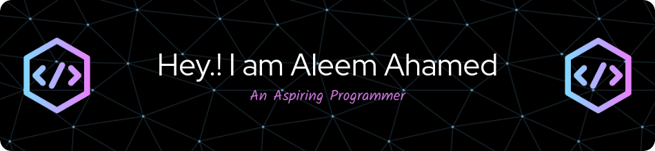

 

I'm a budding software developer from India 🇮🇳

**About me**

- 💼 Student at [NIT Raipur](https://nitrr.ac.in/)

- 📈 Learning how to build scalable software.

- ❤️ I love working with Java Backend systems and Javascript frameworks.

- 💬 Ask me about anything [here](https://github.com/ShaikAleemAhamed123/ShaikAleemAhamed123/issues)

#### Languages:

   

#### Frameworks/Platforms:

  
  

#### Data: 
  
 

#### Tools:

<br/ >

|  |  |
| ------------- | ------------- |

#### Top Repositories

 
 

